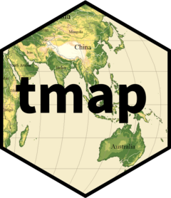

::::: grid
::: {.g-col-12 .g-col-md-2 .justify-text}

:::

::: {.g-col-12 .g-col-md-10 .justify-text}
[**tmap**](https://r-tmap.github.io/tmap/) R package for drawing thematic maps.
:::
:::::

::::: grid
::: {.g-col-12 .g-col-md-2 .justify-text}

:::

::: {.g-col-12 .g-col-md-10 .justify-text}
[**cols4all**](https://cols4all.github.io/cols4all-R/) R package for color palette exploration and analysis.
:::
:::::

::::: grid
::: {.g-col-12 .g-col-md-12 .justify-text}
**tmapverse** meta-package that attaches tmap and its extensions (tmap.glyphs, tmap.networks, tmap.cartogram, tmap.mapgl), together with supporting spatial packages and cols4all. [CRAN](https://cran.r-project.org/web/packages/tmapverse/index.html) [github](https://github.com/r-tmap/tmapverse)
:::
:::::

::::: grid
::: {.g-col-12 .g-col-md-12 .justify-text}
**tmaptools** R package that offers a set of tool funtions for reading and processing spatial data. [CRAN](https://cran.r-project.org/web/packages/tmaptools/index.html) [github](https://github.com/r-tmap/tmaptools)
:::
:::::

::::: grid
::: {.g-col-12 .g-col-md-12 .justify-text}
**tmap.cartogram** R package for creating cartograms. [Home](https://r-tmap.github.io/tmap.cartogram/index.html)
[CRAN](https://cran.r-project.org/web/packages/tmap.cartogram/index.html) [github](https://github.com/r-tmap/tmap.cartogram)
:::
:::::

::::: grid
::: {.g-col-12 .g-col-md-12 .justify-text}
**tmap.glyphs** R package that extends tmap with glyph-based layers for depicting multivariate data. [CRAN](https://cran.r-project.org/web/packages/tmap.glyphs/index.html) [github](https://github.com/r-tmap/tmap.glyphs)
:::
:::::

::::: grid
::: {.g-col-12 .g-col-md-12 .justify-text}
**tmap.networks** R package for visualizing networks with tmap, e.g. as edge and node layers on top of thematic maps. [CRAN](https://cran.r-project.org/web/packages/tmap.networks/index.html) [github](https://github.com/r-tmap/tmap.networks)
:::
:::::

::::: grid
::: {.g-col-12 .g-col-md-12 .justify-text}
**tmap.mapgl** R package that extends tmap with two new interactive modes, "mapbox" and "maplibre", based on Mapbox GL JS and MapLibre GL JS. [CRAN](https://cran.r-project.org/web/packages/tmap.mapgl/index.html) [github](https://github.com/r-tmap/tmap.mapgl)
:::
:::::

::::: grid
::: {.g-col-12 .g-col-md-12 .justify-text}
**tmap.sources** R package that provides reproducible access to spatial data sources for use with tmap, including a PMTiles reader. [CRAN](https://cran.r-project.org/web/packages/tmap.sources/index.html) [github](https://github.com/r-tmap/tmap.sources)
:::
:::::

::::: grid
::: {.g-col-12 .g-col-md-12 .justify-text}
**treemap** R package for treemap visualization. [CRAN](https://cran.r-project.org/web/packages/treemap/index.html) [github](https://github.com/mtennekes/treemap)
:::
:::::
